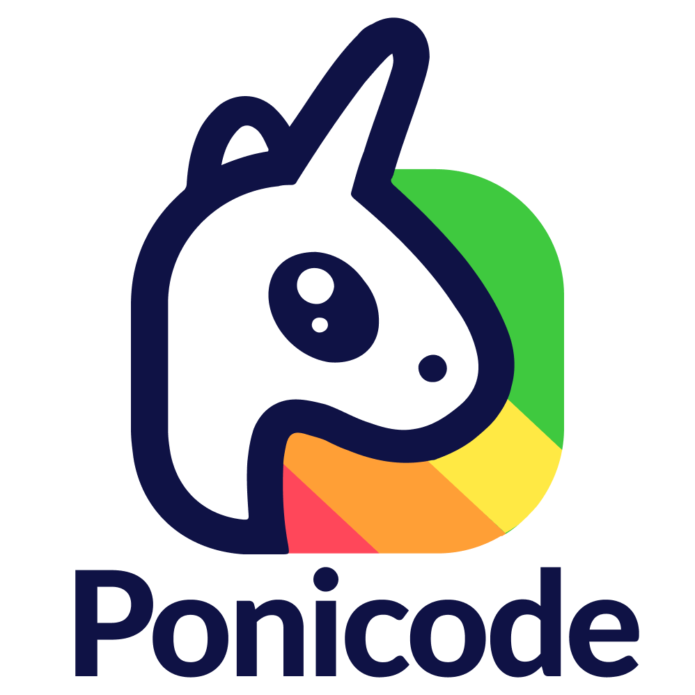

# Продукты по автодополнению кода

**1. IntelliCode**

Компания - Microsoft. Запущен в 2018 году. Бесплатный. Существует в качестве
дополнительной опции установки для Visual Studio и расширения для Visual Studio
Code. Изначально поддерживал только C#, позже стал "понимать" многие другие
языки. В версии для VS список языков фиксирован, в версии для VS Code -
расширяется при установке сторонних языковых пакетов. Предлагает продолжение для
уже начатой строки

**2. GitHub Copilot**

Компания - GitHub, OpenAI. Запущен в 2021 году. Платный. Существует в качестве
расширений для разных IDE и редакторов кода: VS Code, IDE от JetBrains, Neovim.
Предлагает фрагменты кода из репозиториев GitHub, на которых собственно
обучался. Генерирует строку сразу. Используется одна модель для всего.
Использует ваш код для своего дообучения

**3. Kite**

<article>
    
    
</article>

Компания - Kite. Один из самых старых продуктов в этой сфере - запущен в 2014,
однако был закрыт в 2021. Сейчас на официальном сайте закреплен свежий пост о
причинах закрытия проекта, переход на другие страницы всё равно возвращает на
статью, что усложняет сбор информации. Интегрировался с VS Code, IntelliJ,
PyCharm, Sublime, Atom, Spyder, WebStorm, JupyterLab, JupyterHub, Vim.
Поддерживал Java, Kotlin, Scala, Python, C/C++, Objective-C, C#, Golang,
JavaScript, TypeScript, HTML/CSS, Less   

**4. Tabnine**

Компания - Tabnine. Был запущен в 2019. Имеет бесплатную и платную
"комплектации". Поддерживает пару десятков IDE и редакторов (JetBrains, VS,
VS Code, Sublime, Eclipse, Vim, Jupyter и другие). Обучается на кодовой базе
проекта, следовательно, модели различные для разных проектов. Дополняет и
неначатую строку, и начатую. По словам создателей, обеспечивает приватность
данных проекта. Поддерживает десятки языков, в том числе Matlab (!)

**5. Wing 101**

Компания - Wingware. Запущен в 2000 году. IDE для Python, имеет несколько версий
(в том числе и бесплатную). Соответственно, имеет множество фич, специфичных
для IDE (дебаггер, поддержку удалённой разработки, расширений, рефакторинги, 
поддержку юнит-тестирования и прочее)

**6. Ponicode**

<article>
    
    
</article>

Компания - CircleCI. Поддерживает VS Code (JS, TS, Python), IntelliJ (Java).
Генерирует юнит-тесты для уже написанного кода, помогает их визуализировать,
предлагает сценарии по некоторому описанию

## В качестве заключения

Само собой, существуют также ещё десятки, например, расширений для VS Code,
которые решают подобные задачи. Я же постарался описать лишь самые интересные,
знаковые продукты.

Среди продуктов есть и IDE, и расширения для различных других IDE. Самым
лучшим среди них кажется Tabnine, ведь он и работает в более привычных
разработчику инструментах, и поддерживает многие языки, и сохраняет
приватность ваших данных
