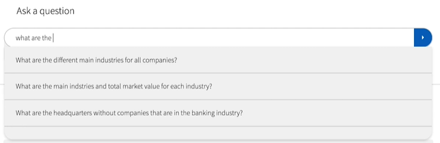
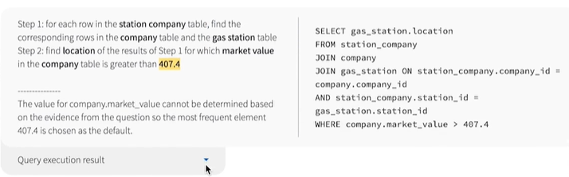
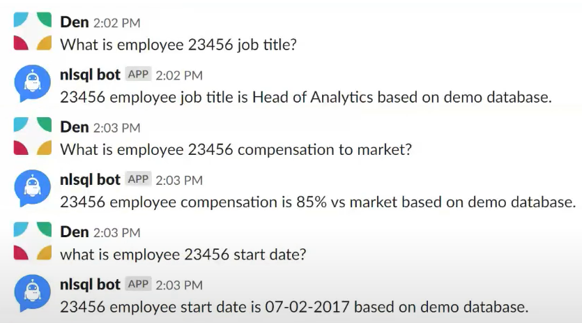
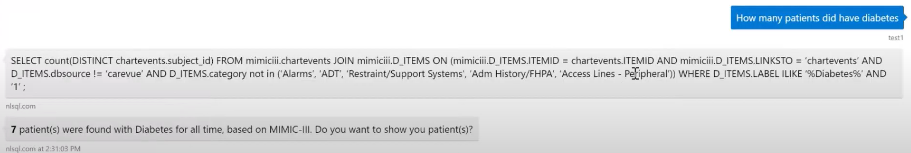
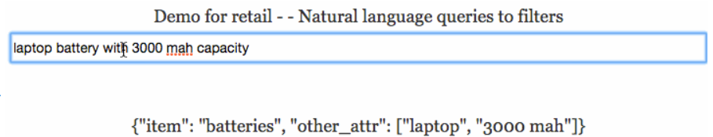

# Упражнение

`Провести исследование продуктов на основе технологии text-to-SQL
(на что нацелен продукт, для кого и т.д.)`

По сравнению с инструментами для автодополнения кода генераторы SQL менее
распространены, вариантов и открытой информации тут меньше.

**1. [Turing by Borealis AI](https://www.borealisai.com/product/turing/)**

Запущена в июне 2021 года. В 2020-2021 годах была среди лучших моделей в
бенчмарке Spider. Предназчена для нетехнических пользователей. В обучении
использовано более 100 баз данных, однако модель может работать и на базах с
незнакомой структурой.

Есть демо версия с автодополнением английского текста, которого уже и
генерируются запросы. Предоставляется несколько вариантов запросов с описанием
выполняемых действий. Так же модель может предупреждать о нехватке данных.
После этого уже пользователь нажимает на кнопку и получает результат.

**2. [NLSQL](https://www.nlsql.com/solutions/)**

Имеет решения для различных задач и пользователей. Выполнены в качестве API,
который генерирует SQL по текстовому запросу. Далее поверх него можно сделать
какой-либо удобный вам интерфейс. Обычно это чат в различных приложениях -
Slack, Skype и так далее.

Среди предметных областей есть:
- здравоохранение - для клинических исследователей
- SAP - для нетехнических специалистов
- HR - для HR-менеджеров
- SmartCity - для доступа к публичным данным для жителей города
- eCommerce, ретейл - например, для владельца бизнеса
- нефтегазовая отрасль - для менеджера энергетической компании

**3. [That Needle](https://thatneedle.com/nlp-api.html)**

Позволяет разобрать короткую поисковую фразу на части, выделить фильтры по
разным свойствам, потенциальным столбцам. Понимает сокращения в зависимости от
контекста: в фразе `refrigerator 20 l` `l` означает литры, а в `20 l bulb` -
люмены.

Так же предоставляется в виде API. По заявлениям создаталей результат может
быть представлен в виде SQL запроса и в виде JSON с описанием фильтра (как на
картинке), чтобы, например, конструировать NOSQL-запросы.

Возможно, это самая старая по исполнению подобная модель. Демо-видео для неё
опубликовано 7 лет назад.

# Сравнение

## Реализация и доступ

Через API во всех случаях

## Подсказки в текстовом вводе

В первых двух вариантах интерфейс поддерживает подсказки в вводе, третий же
вариант работает только с готовым вводом

## Результат

Первый поддерживает генерацию и исполнение запроса, второй - только генерацию,
исполнение будет задачей человека или же вашего приложения-клиента. Третий
вариант может сгенерировать запрос, а может вернуть объект-фильтр для
специфичных целей

## Предметные области

Первая модель работает в любой области, вторая - лишь в определённых, тех, на
которых она была дообучена (поэтому результат должен быть лучше), по третей
информации слишком мало, на демо-видео она работает в сфере электроники

# Вывод

На данный момент существует достаточно мало продуктов, основанных на
texl-to-sql, несмотря на развитие этой области и появление всё новых работ на
эту тему. Они не очень популярны. Судя по всему, по различным причинам на данный
момент генерация запросов человеком больше подходит для компаний. Возможно, всё
ещё впереди.